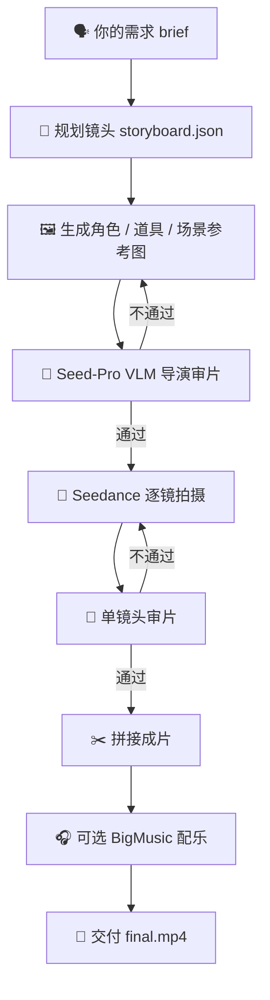

<div align="center">

# 🎬 VibeFilming

### 一句话开拍，一把 Key 调通 Seed-Pro / Seedream / Seedance

把「我想要一条什么样的短片」丢给它，剩下的交给 AI 导演。

**分镜 🧩 · 出图 🖼️ · 拍摄 🎥 · 审片 🧐 · 返工 🔁 · 拼接 ✂️ · 配乐 🎧 · 交付 🎁**

<br/>


<br/>

`一句话开拍`　·　`无需 Prompt 技巧`　·　`只填 ark.api_key`　·　`自动审片返工`　·　`最终交付 mp4`

</div>

---

## ⚡ 第一眼重点：真的只要一把 Key

> **必填配置只有一个：火山方舟 `ark.api_key`。**
>
> 这一把 Key 同时驱动 Agent 思考、导演审片、参考图生成、视频生成等核心链路。

| 能力 | 默认模型 | 用来做什么 |
|---|---|---|
| 🧠 **Seed-Pro / Seed 2.0 Pro** | `doubao-seed-2-0-pro-260215` | Agent 推理、脚本规划、分镜拆解 |
| 👀 **Seed-Pro VLM** | `doubao-seed-2-0-pro-260215` | 看图、看视频、导演式审片 |
| 🖼️ **Seedream** | `doubao-seedream-4-5-251128` | 角色三视图、场景图、关键帧、图编辑 |
| 🎥 **Seedance** | `doubao-seedance-2-0-260128` | 多镜头视频生成、参考图驱动拍摄 |
| 🎧 **BigMusic** | 选填 `volc.ak / volc.sk` | 自动生成整片 BGM，不填也能完整出片 |

```txt
你填一把 ark.api_key
        ↓
Seed-Pro 负责想
Seedream 负责画
Seedance 负责拍
Seed-Pro VLM 负责审
        ↓
VibeFilming 负责把它们串成一部片
```

---

## 🍿 一句话，看懂它在干嘛

> 你说：**「做一条 30 秒宠物公益短片，温暖一点，结尾有领养呼吁。」**
>
> 它做：**拆镜头 → 建角色参考 → 逐镜拍摄 → AI 自审 → 不过审就重拍 → 拼接成片 → 配上 BGM → 交付 `final.mp4`**

这不是「输入提示词，吐一段视频」的一次性脚本。

**VibeFilming 更像一个会自己开工的 AI 导演：会拆片、会选工具、会审片、会返工、会把多段素材拼成完整短片。**

---

## 🔥 为什么影视小白也能直接用？

| 使用门槛 | 普通 AI 视频工具 | VibeFilming |
|---|---|---|
| 💬 **表达方式** | 要会写 Prompt、懂镜头词、懂参数 | 直接说大白话，系统自动翻译成工程化指令 |
| 🔑 **配置成本** | 文本、图像、视频、多模态各配各的 Key | **一把 `ark.api_key` 调通 Seed-Pro / Seedream / Seedance** |
| 🎞️ **成片交付** | 多数只给你一段素材，还要自己剪 | 按短片流程自动拼接，最终交付 `final.mp4` |
| 🧠 **操作负担** | 用户反复点按钮、调参数、判断要不要重做 | Agent 自己拆镜头、选工具、审片、返工 |
| 🧬 **稳定程度** | 多镜头容易变脸、变物、跳场景 | 角色/道具/场景参考图 + 链式承接，尽量稳住一致性 |
| ⏱️ **等待时间** | 多段视频通常一段段排队等 | 适合分镜时自动并行生成、并行审核 |
| 📚 **使用经验** | 每次踩坑都靠人记 | 成功经验和失败案例沉淀到 `skills/` 与记忆 |

---

## ✨ 六个值得 Star 的细节

### 1. 🎬 从「出一段」升级到「出一部」

现在的 AI 视频模型很强，但大多停在「一句话 → 一段素材」。真正要交付短片，还得拆镜头、保一致性、衔接镜头、审片、返工、拼接、配乐。VibeFilming 把这条链路全包了。

### 2. 🧙 告别 Prompt 玄学

你不用背「大师级咒语」，也不用手调一堆模型参数。你说大白话，系统自动补齐主体定义、镜头语言、动作顺序、音频约束、反例规避。

### 3. 🧠 它会做导演该做的决策

先做角色还是先做场景？该串行还是并行？哪一段需要重拍？哪些素材能复用？这些都交给 Agent 自己判断。

### 4. 🧐 自带导演审片，不再靠抽卡出片

每张参考图、每段视频、每版成片都会进入 AI 审片。它不是简单打分，而是像导演一样把关：主角对不对、角色有没有变脸、动作自然不自然、镜头有没有断、情绪有没有到。出片不再靠反复抽卡碰运气，而是有一个 AI 导演持续盯片、挑错、返工。

### 5. ⚡ 能分镜就并行，生成和审核一起提速

VibeFilming 有并行机制：当它判断你的片子适合拆成多个分镜拍摄时，会自动拆镜头、并行提交生成任务，并行进入审片流程。不是一段段傻等，而是在保证可控的前提下把等待时间压下来。

### 6. 🔑 配置极简，第一步就能跑

必填只有 `ark.api_key`。它覆盖 Seed-Pro 思考 / VLM 审片 / Seedream 出图 / Seedance 出视频。音乐 Key 是增强项，不填照样能跑完整视频流程。

---

## 🎥 它能帮你拍什么？

| 场景 | 你可以这样说 | 它会做什么 |
|---|---|---|
| 🧡 公益短片 | 「做一条 30 秒垃圾分类公益片，要温暖、有记忆点」 | 拆成多镜头故事，生成角色/场景参考，拍摄、审片、拼成完整 mp4 |
| 🧋 产品广告 | 「给一款冷萃咖啡做 15 秒竖屏广告，适合投小红书」 | 按广告节奏设计镜头，突出卖点，生成竖屏短片 |
| 🌧️ 短剧 / 情绪片 | 「做一个雨夜重逢的 30 秒情绪短片，电影感强一点」 | 建人物三视图，控制氛围，串联多段视频保持角色一致 |
| 🐱 IP / 角色展示 | 「让这只橘猫当主角，做一个萌宠领养宣传片」 | 先锁定角色视觉，再围绕同一主体生成多镜头故事 |
| ⚔️ 概念片 / 预告 | 「做一段科幻武侠预告，刀光、雨夜、霓虹城市」 | 用视觉参考 + 链式承接维持风格，合成概念预告片 |

> 📖 **第一次用？** 先看 [DIRECTOR_GUIDE.md](./DIRECTOR_GUIDE.md)——给导演看的人话手册：每个工具干嘛用、想改拍法去哪改、0 代码加新技能。

---

## 🚀 3 步开拍

### Step 1. 🛠️ 安装

```bash
bash setup.sh
```

脚本会自动完成：

```txt
检查 Python 3.11/3.12
    ↓
创建 .venv
    ↓
安装依赖
    ↓
复制 vibefilming.config.json
```

### Step 2. 🔑 填一把 Ark Key

打开 `vibefilming.config.json`，填入你的火山方舟 ARK API Key。

这一把 Key 会同时覆盖：

```txt
🧠 Agent 思考      → Seed-Pro
👀 AI 审片         → Seed-Pro VLM
🖼️ 参考图 / 关键帧 → Seedream
🎥 视频拍摄        → Seedance
```

```json
{
  "ark": {
    "api_key": "ark-XXXXXXXX-XXXX-XXXX-XXXX-XXXXXXXXXXXX",
    "api_base": "https://ark.cn-beijing.volces.com/api/v3",
    "models": {
      "text": "doubao-seed-2-0-pro-260215",
      "vlm": "doubao-seed-2-0-pro-260215",
      "image": "doubao-seedream-4-5-251128",
      "video": "doubao-seedance-2-0-260128"
    }
  }
}
```

> 💡 **想换模型？** 直接改 `ark.models` 即可。比如把 Seedream 4.5 换成你已开通的 5.0 lite，只改 `image` 字段就行。
>
> 🎵 **想自动配 BGM？** 选填 `volc.ak / volc.sk`（火山 BigMusic），不填也能跑完整视频流程，只是不会自动生成整片 BGM。

### Step 3. 🎬 开拍

```bash
source .venv/bin/activate
python3 agentmain.py
```

进控制台后直接说人话：

```
> 给我做一段关于宠物的温情小视频
> 生成一段 30s 的科幻武侠片
> 帮我剪一个 15 秒夏日海边短片，竖屏，海浪原生音 + 钢琴 BGM
```

退出：`Ctrl+C` 或 `/exit`。

---

## 🧠 凭什么它能「自主」？

**关键不在工具多，而在架构：VibeFilming 没把流程写死，而是让 Agent 自己判断下一步该干嘛。**

- **运行内核**：一个能调工具、会循环、能自审、能记账的 Agent 主循环。它负责"想下一步该干嘛"，但流程不钉死，可根据审片反馈随时跳回重做、换思路。
- **技能库**：把"怎么当导演拍片"的全部经验沉淀成一篇篇 `SKILL.md`，内核按需读取、自己判断该用哪条。

> 🧩 **内核负责判断，技能库负责经验。**
>
> 没有固定流程图，没有一条路走到黑。Agent 会自己读经验、自己拿主意。<br/>
> **改拍法 = 改 md，不碰一行代码。**

它真的像个导演而非流水线，靠的是下面四件事：

### 1. 🧐 导演式自审：每个产物 AI 当导演审一眼

不是考试打分题（"是否符合 A+B+C+D"），而是导演审美题（"作为导演，你看上了哪些点？哪里不对？"）。

```
✅ 过审 → 进下一步
❌ 不过审 → 给出"问题诊断 + 想要的样子" → Agent 自动翻译成合规指令 → 重做（最多 2 轮）
```

按产物类型分 **基准图 / 单镜头 / 全片成片** 三套模板，各有专属的导演关注重心。

### 2. 🧙 内置指令工程：你不用学 Prompt，它帮你写

每次出图/出视频前，Agent 会自动按内部标准走一套检查：任务类型、主体定义、动态顺序、符号规范、配乐闸门、时长比例、反例扫描。**你只管说大白话，它负责翻译成模型最听得懂的工程化指令，并自动规避这 5 个最常见的翻车点：**

| # | 常见翻车点 | 翻车现场 |
|---|---|---|
| 1 | 多主体没定义清楚 | 三个垃圾桶分不清谁是谁 |
| 2 | 主体特征中途变了 | 「红裙女孩」开头红裙结尾蓝裙 |
| 3 | 多素材没绑定 | 给了三视图，指令却只写「老奶奶」 |
| 4 | 描述顺序乱 | 主体写在镜头之后，画面歪 |
| 5 | 张嘴无声 | 写「老奶奶夸奖」没补台词 → 演员张嘴演哑剧 |

### 3. ⚡ 智能并行调度：能并行时就并行

VibeFilming 不是固定按顺序一段段拍。它会先判断片子结构：如果适合拆成多个相对独立的分镜，就自动拆镜头，并行提交生成任务。

生成之后也不是攒到最后一起看，而是并行进入审片流程。能同时推进的镜头同时推进，只有确实需要承接上一段画面时才走串行链路。

> 提示词含对话时，会明确写出谁在说话（如"女孩说：{我们一起带它回家吧}"），避免模型只看到台词却不知道谁在张嘴。

### 4. 🎧 BGM 必须走后期：视频模型不脑补配乐

视频生成阶段默认不出音轨，避免模型自行脑补杂乱配乐。整片 BGM 由流水线最后一步统一生成（火山 BigMusic GenBGM v5.0），由 Agent 自主判断要不要配、配什么风格。

---

## 📈 越用越聪明

不是每次从零开始——拍过的片、踩过的坑会**沉淀下来反哺下一次**：

- **分层记忆**：任务收尾时，把这次*验证成功*的经验蒸馏进多层记忆（索引 / 事实库 / 任务 SOP / 历史会话）。铁律是「没有执行就没有记忆」——只有真正跑通的结果才准进记忆，杜绝把猜测当事实。
- **踩坑沉淀**：每个 `SKILL.md` 都挂着真实的「已踩坑」案例，复盘后写回文档，下次开机自动加载，同一个坑不踩第二次。

> **进化是开放的**：你或 Agent 发现新坑，只要在 `skills/` 下新建一个文件夹 + 一个 `.md` 文件，**0 代码、下次对话即生效**。

---

## 🎞️ 完整工作流



### 📦 产物目录

```txt
projects/<project_id>/
├── manifest.json     ← 项目状态记录
├── entities/         ← 角色/道具/场景基准图
├── shots/            ← 每个镜头的 mp4 + 关键帧
├── composed/         ← final_xxx.mp4（最终交付）
├── audios/           ← BGM mp3
├── reviews/          ← 每次 AI 审片的问答记录
└── logs/             ← 完整工具调用日志（含预算总账）
```

---

## 🧠 设计原则

| 原则 | 含义 |
|---|---|
| 🧠 **决策 / 知识分层** | 内核只管判断与循环，影视经验压进技能文档和工具，互不污染 |
| 🛣️ **流程不钉死** | Agent 自己读经验、拿主意，随时跳回重做 / 跳过 / 换思路 |
| 📈 **越用越聪明** | 经验蒸馏进记忆，踩坑写回文档，下次自动加载 |
| 🧐 **导演视角自审** | AI 不做机械打分，而是按导演审美发散性评判 |
| 🧩 **加技能 0 代码生效** | `skills/` 下新建文件夹 + `SKILL.md`，开机自动加载 |
| 💰 **小步快跑，节约预算** | 单次只出最小可验证产物，能编辑不重画，能并行就并行 |

---

## ❓ 常见问题

<details>
<summary><b>🔐 报 401 / 403？</b></summary>

`vibefilming.config.json` 里 `ark.api_key` 没填对，或对应模型没在火山方舟开通访问权限。
</details>

<details>
<summary><b>🎧 BGM 报 200028 APINoSource？</b></summary>

火山 BigMusic 服务没开通。去 https://console.volcengine.com/ai-music 开通"音乐生成"服务即可。
</details>

<details>
<summary><b>🧰 报 ffmpeg not found？</b></summary>

`setup.sh` 装的 `imageio-ffmpeg` 自带 ffmpeg。如还报错：`brew install ffmpeg`（macOS）/ `apt install ffmpeg`（Linux）。
</details>

<details>
<summary><b>⏳ 视频任务长时间不返回？</b></summary>

视频模型单段 200–300s 是正常的。查询状态最多阻塞 5 分钟，超时可重试。
</details>

<details>
<summary><b>🧯 Agent 卡住没反应？</b></summary>

`Ctrl+C` 重启即可。项目状态都在 `projects/<id>/manifest.json`，不会丢。
</details>

<details>
<summary><b>🔁 想换模型？</b></summary>

编辑 `vibefilming.config.json` 里的 `ark.models`。文本、VLM、生图、生视频都能分别切换到你已开通的豆包模型：

```json
{
  "text": "doubao-seed-2-0-pro-260215",
  "vlm": "doubao-seed-2-0-pro-260215",
  "image": "doubao-seedream-4-5-251128",
  "video": "doubao-seedance-2-0-260128"
}
```
</details>

---

## 🎮 控制台命令

| 命令 | 说明 |
|---|---|
| 🆕 `/new` | 开新对话清空上下文（项目文件保留） |
| 🔄 `/continue` | 列出可恢复的会话快照 |
| 🧠 `/llm` | 切换大模型 |
| 🌡️ `/session.temperature=0.3` | 临时调采样温度 |
| 🚪 `/exit` | 退出 |

---

## 📚 想深入研究？

| 文档 | 内容 |
|---|---|
| 📘 [DIRECTOR_GUIDE.md](./DIRECTOR_GUIDE.md) | **导演手册（人话版）**：工具说明 + 想改拍法去哪改 + 0 代码加新技能 |
| 🧙 [skill_prompt_engineering](./skills/skill_prompt_engineering/SKILL.md) | 指令工程 7 步 + 5 大常见翻车点 |
| 🧐 [skill_director_vlm](./skills/skill_director_vlm/SKILL.md) | AI 当导演的三场景审片模板 |
| 🧬 [skill_entity_consistency](./skills/skill_entity_consistency/SKILL.md) | 角色一致性 / 三视图 / 防 ID 漂移 |
| 🔗 [skill_video_chain](./skills/skill_video_chain/SKILL.md) | 链式衔接 / 帧裁剪 / 防画质劣化 |
| 🧩 [skill_storyboard](./skills/skill_storyboard/SKILL.md) | 分镜设计 / 并行或链式出片路线选择 |

---

<div align="center">

### 🎬 让 AI 当导演，让你只说一句话

**如果它帮你省下了熬夜剪辑的时间，给个 ⭐ Star 支持一下吧。**

`One brief in` → `final.mp4 out`

</div>
