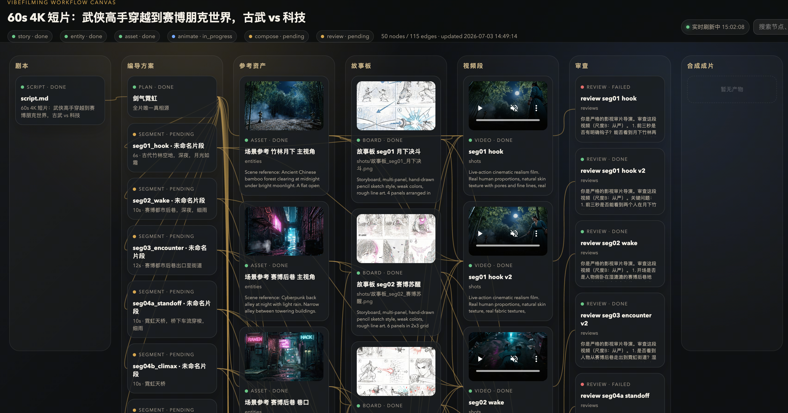
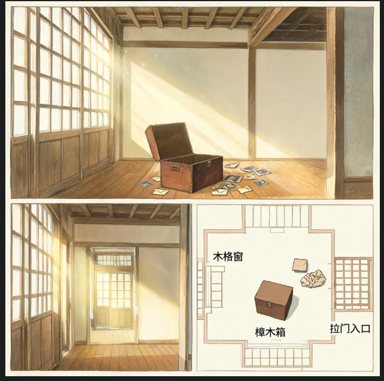

<div align="center">

# 🎬 VibeFilming

### 一句大白话，产出专业级成片

不用写 Prompt、不用懂镜头参数、不用一遍遍手动调整重做——你只说「我想要一条什么样的短片」，Agent 把分镜、拍摄、审片、返工、拼接、配乐全包到底，直接交付 `final.mp4`。

**分镜 🧩 · 出图 🖼️ · 拍摄 🎥 · 审片 🧐 · 返工 🔁 · 拼接 ✂️ · 配乐 🎧 · 交付 🎁**

<br/>


<br/>

`一句话出片`　·　`无需 Prompt 技巧`　·　`实时工作流看板`　·　`自动审片返工`　·　`一把 ark.api_key`　·　`交付 final.mp4`

</div>

---

## 它解决什么

别的 AI 视频工具给你**一段素材**，你还得自己拆镜头、保一致性、剪辑、配乐。

VibeFilming 给你**一部成片**。你说：

> **「做一条 30 秒宠物公益短片，温暖一点，结尾有领养呼吁。」**

它做：**拆镜头 → 建角色参考 → 逐镜拍摄 → AI 自审 → 不过审就重拍 → 拼接 → 配 BGM → 交付 `final.mp4`**。

专业流程一步不少，但你一步都不用学——不写 Prompt、不调参数、不碰剪辑软件。

> 🎞️ **想看真实全流程？** 一条水墨武侠预告从 50 字需求到成片、再到对话式改片的完整过程 👉 [使用示例](./demo.md)

---

## 👁️ 全程可视化，不再黑盒等待

一跑起任务，后台自动起一个常驻 HTTP 服务，终端给你链接。打开浏览器，剧本、编导方案、参考资产、故事板、视频渲染、AI 审片、最终合成——每个节点的状态和产物**随进度自动刷新**，一目了然。

<div align="center">

</div>

---

## ✨ 六个关键能力

**🧙 不写 Prompt，说人话就行**
出图 / 出视频前，Agent 自动补齐主体定义、镜头语言、动作顺序，内置四层质感框架（环境 / 镜头 / 材质 / 显影）和情绪微表情链路，自动绕开「多主体分不清、主体中途变样、给了三视图却只写名字、描述顺序乱、张嘴无声」这几个高频翻车点。

**🧊 更好的空间感，多镜头不跳戏**
每个场景强制建**多视角参考包 + blocking 走位图**，把站位、动线、门内外关系画清楚再开拍；站位不对时用**图 + 文字双通道**纠正——图锁空间、文字锁语义，把「谁在左、谁从右进、视线在哪交汇」说死。

<div align="center">

</div>

**🧐 自带导演审片，不靠抽卡**
每张图、每段视频、每版成片都进 AI 审片：主角对不对、有没有越轴、情绪因果通不通、四层质感够不够。发现**该出现的角色 / 道具根本没出现，会自动回补资产、更新方案再重拍**，而不是删参考硬凑。

**✏️ 改片也说人话**
「第二镜慢一点」「结尾字幕去掉」「整体调暖一点」——Agent 自己判断重生成哪一镜、该编辑还是重画、要不要重拼。生成和修改是同一种体验。

**⚡ 能分镜就并行**
适合拆的片子自动拆镜头、并行拍、并行审；只有真要承接上一段画面才走串行，把等待压下来。

**🎧 BGM 走后期，不脑补**
生成阶段默认不出音轨，整片 BGM 最后一步统一生成（火山 BigMusic）。跨段配乐先定架构（统一整轨 / 分段自带但有头有尾），避免段间忽大忽小、突然断掉。

> � **越用越聪明**：踩过的坑会沉淀进 `SKILL.md`，下次开机自动加载，同一个坑不踩第二次。

---

## 🌟 只填一把 Key

**必填配置只有一个：火山方舟 `ark.api_key`。** 它同时驱动思考、审片、生图、生视频，不用在多个厂商凑齐 Key 才能开工。

| 能力 | 默认模型 | 用来做什么 |
|---|---|---|
| 🧠 **DeepSeek V4 Pro** | `deepseek-v4-pro-260425` | Agent 推理、脚本规划、分镜拆解 |
| 👀 **Seed-Pro VLM** | `doubao-seed-2-1-pro-260628` | 看图、看视频、导演式审片 |
| 🖼️ **Seedream** | `doubao-seedream-5-0-260128` | 角色三视图、场景图、关键帧、图编辑 |
| 🎥 **Seedance** | `doubao-seedance-2-0-260128` | 多镜头视频生成、参考图驱动拍摄 |
| 🎧 **BigMusic** | 选填 `volc.ak / volc.sk` | 自动生成整片 BGM，不填也能完整出片 |

同源生态协同、成本一处结算、换模型只改一个字段——`ark.models` 里改哪个字段换哪个模型。

---

## 🎥 能帮你拍什么

| 场景 | 你可以这样说 |
|---|---|
| 🧡 公益短片 | 「做一条 30 秒垃圾分类公益片，要温暖、有记忆点」 |
| 🧋 产品广告 | 「给一款冷萃咖啡做 15 秒竖屏广告，适合投小红书」 |
| 🌧️ 短剧 / 情绪片 | 「做一个雨夜重逢的 30 秒情绪短片，电影感强一点」 |
| 🐱 IP / 角色展示 | 「让这只橘猫当主角，做一个萌宠领养宣传片」 |
| ⚔️ 概念片 / 预告 | 「做一段科幻武侠预告，刀光、雨夜、霓虹城市」 |

> 📖 **第一次用？** 先看 [DIRECTOR_GUIDE.md](./DIRECTOR_GUIDE.md)——给导演看的人话手册。

---

## 🚀 3 步开拍

```bash
# 1. 拉代码 & 安装（自动建 .venv、装依赖、复制配置）
git clone https://github.com/your-org/Vibefilming.git
cd Vibefilming && bash setup.sh

# 2. 填 Key：打开 vibefilming.config.json，填火山方舟 ark.api_key

# 3. 开拍
source .venv/bin/activate
python3 agentmain.py
```

`vibefilming.config.json` 最小配置：

```json
{
  "ark": {
    "api_key": "ark-XXXXXXXX-XXXX-XXXX-XXXX-XXXXXXXXXXXX",
    "api_base": "https://ark.cn-beijing.volces.com/api/v3",
    "models": {
      "text": "deepseek-v4-pro-260425",
      "vlm": "doubao-seed-2-1-pro-260628",
      "image": "doubao-seedream-5-0-260128",
      "video": "doubao-seedance-2-0-260128"
    }
  }
}
```

进控制台后直接说人话，同时点终端链接打开实时画布：

```
● 实时工作流看板 http://127.0.0.1:8765/canvas.html  (随进度自动刷新)

> 给我做一段关于宠物的温情小视频
> 生成一段 30s 的科幻武侠片
> 帮我剪一个 15 秒夏日海边短片，竖屏，海浪原生音 + 钢琴 BGM
```

退出：`Ctrl+C` 或 `/exit`。

> 🎵 **想自动配 BGM？** 选填 `volc.ak / volc.sk`（火山 BigMusic），不填也能跑完整流程。

---

## 🧠 凭什么它能「自主」

没把流程写死，而是让 Agent 自己判断下一步该干嘛。

- **运行内核**：能调工具、会循环、能自审、能记账的主循环，可随审片反馈跳回重做、换思路。
- **技能库**：把「怎么当导演拍片」的经验沉淀成一篇篇 `SKILL.md`，内核按需读取。

> 🧩 **内核负责判断，技能库负责经验。改拍法 = 改 md，不碰一行代码，下次对话即生效。**

---

## 📦 产物目录

```txt
projects/<project_id>/
├── manifest.json       ← 项目状态记录
├── workflow_graph.json ← 实时工作流节点数据
├── canvas.html         ← 本地可视化工作流看板
├── entities/           ← 角色/道具/场景基准图
├── shots/              ← 每个镜头的 mp4 + 关键帧
├── composed/           ← final_xxx.mp4（最终交付）
├── audios/             ← BGM mp3
├── reviews/            ← 每次 AI 审片的问答记录
└── logs/               ← 完整工具调用日志（含预算总账）
```

---

## ❓ 常见问题

<details>
<summary><b>🔐 报 401 / 403？</b></summary>

`vibefilming.config.json` 里 `ark.api_key` 没填对，或对应模型没在火山方舟开通访问权限。
</details>

<details>
<summary><b>🎧 BGM 报 200028 APINoSource？</b></summary>

火山 BigMusic 服务没开通。去 https://console.volcengine.com/ai-music 开通"音乐生成"服务即可。
</details>

<details>
<summary><b>🧰 报 ffmpeg not found？</b></summary>

`setup.sh` 装的 `imageio-ffmpeg` 自带 ffmpeg。如还报错：`brew install ffmpeg`（macOS）/ `apt install ffmpeg`（Linux）。
</details>

<details>
<summary><b>⏳ 视频任务长时间不返回？</b></summary>

视频模型单段 200–300s 是正常的。查询状态最多阻塞 5 分钟，超时可重试。
</details>

<details>
<summary><b>🧯 Agent 卡住没反应？</b></summary>

`Ctrl+C` 重启即可。项目状态都在 `projects/<id>/manifest.json`，不会丢。
</details>

<details>
<summary><b>🔁 想换模型？</b></summary>

编辑 `vibefilming.config.json` 里的 `ark.models`，文本、VLM、生图、生视频都能分别切换到你已开通的模型。
</details>

---

## 🎮 控制台命令

| 命令 | 说明 |
|---|---|
| 🆕 `/new` | 开新对话清空上下文（项目文件保留） |
| 🔄 `/continue` | 列出可恢复的会话快照 |
| 🧠 `/llm` | 切换大模型 |
| 🌡️ `/session.temperature=0.3` | 临时调采样温度 |
| 🚪 `/exit` | 退出 |

---

## 💬 加入体验交流群

想抢先体验、反馈问题、和其他「AI 导演」一起玩？扫码加入飞书或者微信交流群 👇

<div align="center">

<table>
  <tr>
    <td align="center">
      <br/>
      <b>飞书交流群</b>
    </td>
    <td align="center">
      <br/>
      <b>微信交流群</b>
    </td>
  </tr>
</table>

*扫码进群，一起把短片拍出来*

</div>

---

<div align="center">

### 🎬 让 AI 当导演，让你只说一句话

**如果它帮你省下了熬夜写 prompt 抽卡剪辑的时间，给个 ⭐ Star 支持一下吧。**

`One brief in` → `final.mp4 out`

</div>
